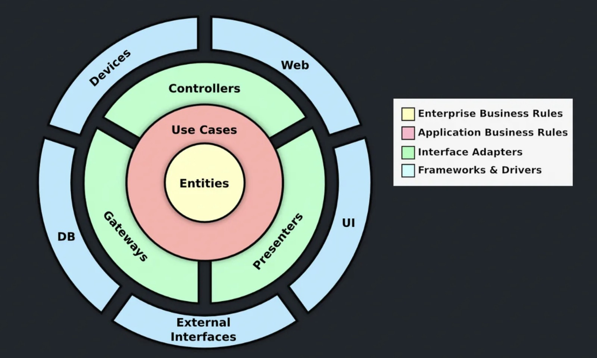

# 🎙️ Audio Recorder - Flutter

## 📌 Project Description
Audio Recorder is a **Flutter** application that allows users to **record, upload, and manage audio files**. It utilizes **Clean Architecture**, **Riverpod for state management**, and **Firebase for storage** to ensure a modular, scalable, and maintainable architecture.

---

## 🚀 Architecture: Clean Architecture + Riverpod

### 📌 **Why Clean Architecture?**
Clean Architecture promotes **separation of concerns**, making the application more **testable, scalable, and maintainable**. It separates the app into three main layers:

- **Presentation Layer** → UI and state management (Riverpod).
- **Domain Layer** → Business logic and use cases.
- **Data Layer** → Data sources and repositories.

### 📌 **Riverpod for Dependency Injection & State Management**
We use **Riverpod** to manage dependencies and global states efficiently. This approach provides:
✅ A centralized dependency container.  
✅ Better testability by easily replacing implementations.  
✅ Optimized state management with providers.  

### 📌 **Architecture Diagram**


---

## 📐 Design Patterns Used

✅ **Clean Architecture** → Layered structure for better scalability.  
✅ **Repository Pattern** → Abstracts data sources for flexibility.  
✅ **StateNotifier & Provider** → Manages state efficiently with Riverpod.  
✅ **Singleton Pattern** → Ensures a single instance of key services.  
✅ **Mocking & Dependency Injection** → Facilitates unit testing.  

---

## 📸 Screenshots

| Recording | Audio List | Uploading |
|-----------|-----------|-----------|
|  |  |  |

---

## 🚀 Continuous Integration (CI)
This project includes a **CI pipeline using GitHub Actions** that automatically runs unit tests whenever a new commit is pushed.

### 📌 **CI Workflow Steps**
1. Runs `flutter analyze` to check for linting errors.
2. Runs all **unit tests** using `flutter test`.
3. If all tests pass ✅, the workflow completes successfully.
4. If a test fails ❌, the PR cannot be merged until fixed.

### 📂 **CI Configuration File**
```yaml
.github/workflows/flutter_ci.yml
```

### 📊 **Viewing Test Results**
1. Go to the **"Actions" tab** on GitHub.
2. Select the workflow **"Flutter CI"**.
3. Check the logs for execution details.

---

## 🛠️ Technologies & Libraries Used
| Technology | Description |
|------------|------------|
| **Flutter 3.x** | Main development framework |
| **Riverpod** | State management and dependency injection |
| **FlutterSound** | Audio recording functionality |
| **Firebase Storage** | Cloud storage for audio files |
| **Mocktail** | Mocking framework for unit testing |
| **Permission Handler** | Manages microphone permissions |

---

## 🧪 Unit & Integration Testing
This project follows **best testing practices** to ensure reliability:

✅ **Unit Tests** for repositories and use cases.  
✅ **Mocking with Mocktail** for dependency isolation.  
✅ **State Management Testing** for Riverpod providers.  

### 📌 **Running Tests**
To execute all tests, run:
```bash
flutter test
```

---

## 📦 Installation & Setup

### 1️⃣ Clone the repository
```bash
git clone https://github.com/yesidsossa/audio-recorder.git
cd audio-recorder
```

### 2️⃣ Install dependencies
```bash
flutter pub get
```

### 3️⃣ Run the app
```bash
flutter run
```

